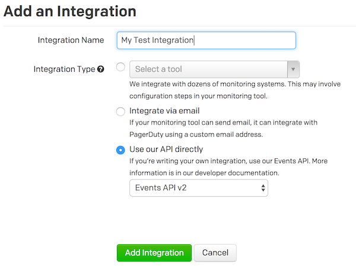
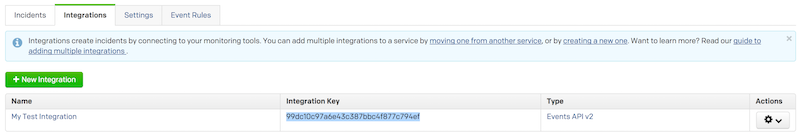

# PagerDuty v2 Events API Wrapper Class

[](https://packagist.org/packages/lukewaite/pagerduty)
[](LICENSE.md)
[](https://travis-ci.org/lukewaite/pagerduty)
[](https://styleci.io/repos/91087655)
[](https://scrutinizer-ci.com/g/lukewaite/pagerduty)
[](https://scrutinizer-ci.com/g/lukewaite/pagerduty/?branch=master)
[](https://packagist.org/packages/lukewaite/pagerduty)

This package makes it easy to send notification events to [PagerDuty](https://www.pagerduty.com)'s [v2 Events API](https://v2.developer.pagerduty.com/docs/send-an-event-events-api-v2).

## Contents

- [Installation](#installation)
	- [Setting up the PagerDuty service](#setting-up-the-PagerDuty-service)
- [Usage](#usage)
	- [Available Message methods](#available-message-methods)
- [Changelog](#changelog)
- [Testing](#testing)
- [Security](#security)
- [Contributing](#contributing)
- [Credits](#credits)
- [License](#license)


## Installation

You can install the package via composer:

```bash
composer require lukewaite/pagerduty
```

## Usage

TODO: Implement usage documentation

### PagerDuty Setup
On a PagerDuty Service of your choice, create a new Integration using the `Events API v2`.



The `Integration Key` listed for your new integration is what you need to set in the `routeNotificationForPagerDuty()` method.



### Available methods

TODO: Update available methods documentation.

See the [PagerDuty v2 Events API documentation](https://v2.developer.pagerduty.com/docs/send-an-event-events-api-v2)
for more information about what these options will do.

## Changelog

Please see [CHANGELOG](CHANGELOG.md) for more information what has changed recently.

## Testing

``` bash
$ composer test
```

## Security

If you discover any security related issues, please email lwaite@gmail.com instead of using the issue tracker.

## Contributing

Please see [CONTRIBUTING](CONTRIBUTING.md) for details.

## Credits

- [Luke Waite](https://github.com/lukewaite)
- [All Contributors](../../contributors)

## License

The MIT License (MIT). Please see [License File](LICENSE.md) for more information.
